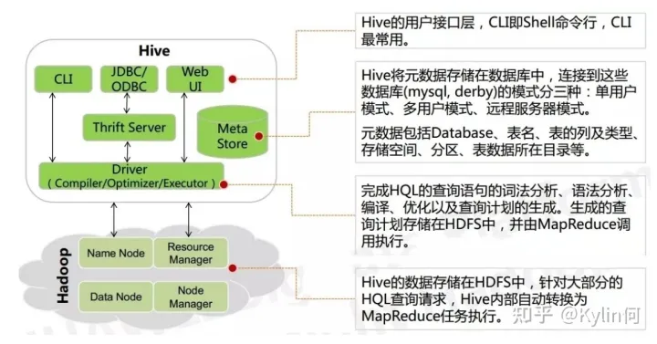
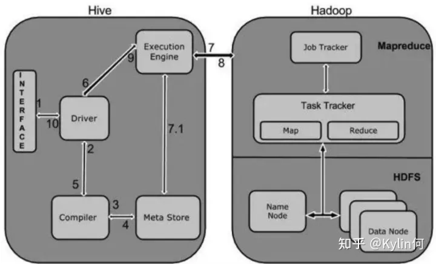

Hive概要
======

1.1 Hive简介
----------

### 1.1.1 Hive出现的原因

由于Facebook网站每天产生海量的结构化日志数据，为了管理这些数据并满足机器学习的需求，Hive作为一个基于Hadoop的数据仓库工具应运而生，并成功发展成为一个Apache项目。

### 1.1.2 什么是Hive

Hive是一个构建在Hadoop上的数据仓库工具（框架），它可以将结构化的数据文件映射成一张数据表，并且可以使用类SQL的方式对这些数据文件进行读取、写入和管理（包括元数据）。Hive的查询语言称为HQL，执行引擎可以是MR、Spark或Tez。

### 1.1.3 本质

Hive的本质是将HQL转换成MapReduce任务，通过完成整个数据的分析查询来降低编写MapReduce的复杂度。

### 1.1.4 Hive的优缺点

优点：

* 学习成本低：提供了类SQL查询语言HQL，使得熟悉SQL语言的开发人员可以快速上手。
* 海量数据分析：底层基于海量计算MapReduce实现。
* 可扩展性：为超大数据集设计了计算/扩展能力，Hive可以自由扩展集群规模，一般情况下无需重启服务。
* 延展性：Hive支持用户自定义函数，用户可以根据需求实现自己的函数。
* 良好的容错性：某个数据节点出现问题时，HQL仍然可以完成执行。
* 统计管理：提供了统一的元数据管理。

缺点：

* Hive的HQL表达能力有限，无法表达迭代式算法。
* Hive的效率较低。
* Hive自动生成的MapReduce作业通常不够智能化。
* Hive调优比较困难，粒度较粗。

1.2 Hive架构和原理
-------------

### 1.2.1 Hive的架构简介

Hive的架构包括以下几个部分：

1. 用户连接接口

    * CLI：Shell命令行接口
    * JDBC/ODBC：Hive的Java实现，类似于传统数据库的JDBC。
    * WebUI：可通过浏览器访问Hive。
2. Thrift Server

    * Hive的可选组件，允许客户端使用Java、C++、Ruby等多种语言通过编程方式远程访问Hive。
3. 元数据

    * Hive将元数据存储在数据库中，如MySQL、Derby等。元数据包括表名、数据库名、表的拥有者、列/分区字段、表的类型（是否是外部表）、表的数据存.

**ChatGPT:**

储位置等信息。

4. 查询编译器和优化器

    * Hive的查询编译器负责将HQL转换成适合执行的物理计划。
    * 优化器对物理计划进行优化，以提高查询性能。
5. 查询执行引擎

    * Hive支持多种执行引擎，包括MapReduce、Spark和Tez等。
    * 执行引擎负责执行物理计划并生成结果。
6. 存储管理

    * Hive支持将数据存储在Hadoop的分布式文件系统（如HDFS）或其他存储系统（如Amazon S3）中。
    * 存储管理模块负责管理数据的存储和访问。
7. 执行环境

    * Hive的执行环境是基于Hadoop的分布式计算框架，如MapReduce、Spark或Tez。
    * 这些执行环境负责将查询分发到集群中的多个计算节点上进行并行处理。

1.3 Hive的使用场景
-------------

Hive适用于以下场景：

1. 海量数据分析

    * Hive能够处理海量的结构化数据，适用于大规模数据分析和处理任务。
2. 批量处理

    * Hive通过将查询转换成MapReduce任务进行批量处理，适用于需要处理大量数据的批量任务。
3. 数据仓库和ETL

    * Hive可以作为数据仓库工具，将结构化数据文件映射成数据表，并支持类SQL的查询和数据提取、转换和加载（ETL）操作。
4. 数据探索和可视化

    * Hive提供了类SQL的查询语言，方便用户进行数据探索和分析，并结合可视化工具（如Tableau、Power BI等）进行数据可视化。
5. 日志分析

    * Hive可以对大量的日志数据进行分析，帮助用户了解用户行为、系统性能等信息。

需要注意的是，由于Hive的查询延迟较高，不适合实时查询和交互式分析场景，对于需要快速响应的查询需求，可以考虑使用其他工具（如Apache Drill、Apache Impala等）或数据仓库解决方案（如Apache Hudi、Apache Iceberg等）。

**ChatGPT:**

8. 数据格式支持

    * Hive支持多种数据格式，包括文本格式（如CSV、TSV）、序列文件格式（如SequenceFile）、列式存储格式（如Parquet、ORC）、Avro格式等。
    * 这些不同的数据格式可以根据需求选择，以提高查询性能和存储效率。
9. 扩展性和容错性

    * Hive构建在Hadoop生态系统之上，具有高度的扩展性和容错性。
    * 它可以与Hadoop集群一起工作，可以根据需要增加或减少计算和存储资源，以满足不同规模和需求的数据处理任务。
10. 用户自定义函数（UDF）

    * Hive允许用户编写自定义函数（UDF）来扩展其功能。
    * 用户可以使用Java、Python等编程语言编写UDF，并将其注册到Hive中，以在查询中使用自定义的函数。
11. 安全性和权限管理

    * Hive提供了安全性和权限管理机制，可以控制用户对数据和资源的访问权限。
    * 可以通过配置Hive的权限模型，为不同的用户和组分配不同的权限，以确保数据的安全性和保密性。
12. 生态系统集成

    * Hive与Hadoop生态系统的其他工具和组件紧密集成，如Hadoop分布式文件系统（HDFS）、YARN资源管理器、HBase、Spark等。
    * 这种集成使得Hive能够与其他工具和组件无缝协作，构建完整的大数据处理和分析解决方案。

总结： Hive是一个开源的数据仓库工具，基于Hadoop生态系统构建，提供了类SQL的查询语言和数据管理功能。它适用于海量数据分析、批量处理、数据仓库和ETL等场景。Hive具有扩展性、容错性和与Hadoop生态系统的紧密集成，同时支持多种数据格式和用户自定义函数。它还提供安全性