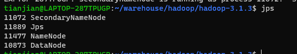

<!-- TOC -->
* [前言](#前言)
  * [一、创建Hadoop用户](#一创建hadoop用户)
* [二、更新apt和安装Vim编辑器](#二更新apt和安装vim编辑器)
* [三、安装SSH和配置SSH无密码登录](#三安装ssh和配置ssh无密码登录)
* [四、安装Java环境](#四安装java环境)
    * [1. 安装JDK](#1-安装jdk-)
    * [2. 配置JDK环境](#2-配置jdk环境)
* [五、安装单机Hadoop](#五安装单机hadoop)
    * [1. 下载安装Hadoop](#1-下载安装hadoop)
    * [2. 运行示例](#2-运行示例)
* [六、遇到问题](#六遇到问题)
    * [1. NameNode无法启动](#1-namenode无法启动)
    * [2. 文件权限问题](#2-文件权限问题)
    * [3. 启动hadoop 报错](#3-启动hadoop-报错)
    * [4. 查看ubuntu 系统版本](#4-查看ubuntu-系统版本)
    * [5. 部署hadoop服务路径文件配置](#5-部署hadoop服务路径文件配置)
<!-- TOC -->

前言
===

Hadoop 单机安装基本配置主要包括以下几个步骤：

创建 Hadoop 用户
更新 apt 和安装 Vim 编辑器
安装 SSH 和配置 SSH 无密码登录
安装 Java 环境
安装单机 Hadoop
这里我的操作系统环境是 Ubuntu20.04，此安装方法同样适用于低版本。

## 一、创建Hadoop用户
创建用户命令如下：

`sudo useradd -m hadoop -s /bin/bash`

接着为 hadoop 用户设置密码，建议三位数，不用太长也要便于记忆：

`sudo passwd hadoop`

然后为 hadoop 用户增加管理员权限：

`sudo adduser hadoop sudo`

切换用户为hadoop登录！


# 二、更新apt和安装Vim编辑器
首先更新 apt：

`sudo apt-get update`

接着安装 Vim 编辑器：

`sudo apt-get install vim`

若电脑已安装则可跳过此步骤。

# 三、安装SSH和配置SSH无密码登录
Ubuntu 操作系统下默认已安装了 SSH 客户端，因此这里我们只需安装 SSH 服务端：

`sudo apt-get install openssh-server`
安装后，可使用以下命令登录本机：

`ssh localhost`
输入 yes 与用户密码，就可以登录到本机，详细输出如下：

```shell
zq@fzqs-computer [11时22分50秒] [/home/hadoop/Downloads]
-> %  ssh localhost
The authenticity of host 'localhost (127.0.0.1)' can't be established.
ECDSA key fingerprint is SHA256:YMFv60J4eT7***c3SA8sfuXU.
Are you sure you want to continue connecting (yes/no/[fingerprint])? yes
Warning: Permanently added 'localhost' (ECDSA) to the list of known hosts.
zq@localhost's password:
Welcome to Ubuntu 20.04.3 LTS (GNU/Linux 5.11.0-36-generic x86_64)

* Documentation:  https://help.ubuntu.com
* Management:     https://landscape.canonical.com
* Support:        https://ubuntu.com/advantage

0 updates can be applied immediately.

Your Hardware Enablement Stack (HWE) is supported until April 2025.

The programs included with the Ubuntu system are free software;
the exact distribution terms for each program are described in the
individual files in /usr/share/doc/*/copyright.

Ubuntu comes with ABSOLUTELY NO WARRANTY, to the extent permitted by
applicable law.
```

接着我们退出 SSH 登录，

`exit`

配置无密码登录：

```shell
cd ~/.ssh/
ssh-keygen -t rsa
```
注意这里第二步要你输入文件名时不用输入，直接一路 Enter 选择默认值就好了！

```shell
cat ./id_rsa.pub >> ./authorized_keys
```
此时再用 ssh localhost 命令无需密码即可登录了。

# 四、安装Java环境
### 1. 安装JDK 
   对于 Hadoop3.1.3 及以上版本而言，需要使用 JDK1.8 或者更新的版本，这里我们使用的 JDK 版本为1.8.0_301，安装包可以从 Oracle 官网下载：https://www.oracle.com/java/technologies/downloads/


接着在 /usr/lib 目录下创建 jvm 文件夹来保存 JDK 文件：

```shell
cd /usr/lib
sudo mkdir jvm
```
解压缩之前的 JDK 文件到上述目录中：

```cd ~/Downloads
sudo tar -zxvf ./jdk-8u301-linux-x64.tar.gz -C /usr/lib/jvm
```
### 2. 配置JDK环境
   使用 gedit 编辑器编辑环境变量：

```shell
sudo gedit ~/.bashrc
```
在文件末尾处添加以下几行内容：

```shell
export JAVA_HOME=/usr/lib/jvm/jdk1.8.0_301
export JRE_HOME=${JAVA_HOME}/jre
export CLASSPATH=.:${JAVA_HOME}/lib:${JRE_HOME}/lib
export PATH=${JAVA_HOME}/bin:$PATH
```
保存并退出，接着使我们刚加入的环境变量生效：

```shell
source ~/.bashrc
```
3. 检验安装
   输入以下命令：

```shell
java -version
```
若出现如下输出则说明安装成功：

```shell
hadoop@fzqs-computer:~$ java -version

java version "1.8.0_301"
Java(TM) SE Runtime Environment (build 1.8.0_301-b09)
Java HotSpot(TM) 64-Bit Server VM (build 25.301-b09, mixed mode)
```

# 五、安装单机Hadoop
### 1. 下载安装Hadoop
   下载地址：https://hadoop.apache.org/releases.html#Download src 源码包！

这里我安装的 Hadoop 版本为3.2.2，下载好后，执行以下命令安装：

```shell
sudo tar -zxf ~/Downloads/hadoop-3.2.2.tar.gz -C /usr/local
```
修改目录名称：

```shell
cd /usr/local
sudo mv  ./hadoop-3.2.2/ ./hadoop
```
赋予可执行权限:

如果全程有hadoop 用户执行，需要加权限给hadoop
```shell
sudo chown -R hadoop ./hadoop
```
进入 hadoop 文件夹，查看安装的 Hadoop 版本信息：

```shell
cd ./hadoop
./bin/hadoop version
```
```shell
hadoop@fzqs-computer:/usr/local/hadoop$ ./bin/hadoop version

Hadoop 3.2.2
Source code repository https://github.com/apache/hadoop.git -r a3b9c37a397ad4188041dd80621bdeefc46885f2
Compiled by ubuntu on 2021-06-15T05:13Z
Compiled with protoc 3.7.1
From source with checksum 88a4ddb2299aca054416d6b7f81ca55
This command was run using /usr/local/hadoop/share/hadoop/common/hadoop-common-3.2.2.jar
```

若出现如上输出，则说明 Hadoop 安装成功。

### 2. 运行示例
   首先在 Hadoop 安装目录下新建 input 子目录：

```shell
cd /usr/local/hadoop
sudo mkdir input
```
复制 “/usr/local/hadoop/etc/hadoop” 中的配置文件到 input 目录下：

```shell
sudo cp ./etc/hadoop/*.xml ./input
```
切换 root 用户 ：

```shell
su
```
执行以下代码运行 Grep 示例：

```shell
./bin/hadoop jar /usr/local/hadoop/share/hadoop/mapreduce/hadoop-mapreduce-examples-3.2.2.jar grep ./input ./output 'dfs[a-z.]+'
```
执行完后，输入以下命令查看输出结果：

```shell
cat ./output/*
hadoop@fzqs-computer:/usr/local/had oop$ cat ./output/*
1    dfsadmin

```

# 五、启动 Hadoop

```shell
cd /usr/local/hadoop
bin/hdfs namenode -format       # namenode 格式化
sbin/start-dfs.sh               # 开启守护进程
jps                             # 判断是否启动成功
```

NameNode、DataNode和SecondaryNameNode



运行 WordCount 实例：

```shell
bin/hdfs dfs -mkdir -p /user/hadoop     # 创建HDFS目录
bin/hdfs dfs -mkdir input
bin/hdfs dfs -put etc/hadoop/*.xml input#将配置文件作为输入
bin/hadoop jar share/hadoop/mapreduce/hadoop-mapreduce-examples-*.jar grep input output 'dfs[a-z.]+'
bin/hdfs dfs -cat output/*    
```


# 六、遇到问题

### 1. NameNode无法启动

core-site.xml配置

```xml
<configuration>
  <property>
    <name>fs.defaultFS</name>
    <value>hdfs://localhost:9000</value>
  </property>

  <property>
    <name>hadoop.tmp.dir</name>
    <value>/home/tianjian/projects/hadoop/tmp</value>
  </property>
</configuration>
```


启动后检查jps和网络端口

```shell
tianjian@TianJian:~/projects/hadoop/hadoop$ jps
23748 SecondaryNameNode
23414 NameNode
23529 DataNode
23871 Jps
tianjian@TianJian:~/projects/hadoop/hadoop$ lsof -i:9000
COMMAND   PID     USER   FD   TYPE DEVICE SIZE/OFF NODE NAME
java    23414 tianjian  297u  IPv4  93321      0t0  TCP localhost:9000 (LISTEN)
java    23414 tianjian  307u  IPv4  83774      0t0  TCP localhost:9000->localhost:48188 (ESTABLISHED)
java    23529 tianjian  397u  IPv4  92790      0t0  TCP localhost:48188->localhost:9000 (ESTABLISHED)
```

### 2. 文件权限问题

当遇到文件下权限有问题时，不能创建文件，修改文件所属权限
```shell
sudo chown -R $USER ./hadoop
```


### 3. 启动hadoop 报错

Error: JAVA_HOME is not set and could not be found

启动时JAVA_HOME找不到

在JDK配置无错的情况下，可能是没有配置hadoop-env.sh文件。这个文件里写的是hadoop的环境变量,主要修改hadoop的JAVA_HOME路径。

1. 切到 [hadoop]/etc/hadoop目录
2. 执行: ```vim hadoop-env.sh```
3. 修改java_home路径和hadoop_conf_dir路径为具体的安装路径
例如：
```shell
export JAVA_HOME=/usr/jdk1.8.0_65
export HADOOP_CONF_DIR=/usr/hadoop-3.1.3/etc/hadoop
```
4. 重新加载使修改生效：source hadoop-env.sh

### 4. 查看ubuntu 系统版本

```shell
lsb_release -a
```
```shell
tianjian@TianJian:~/projects/hive/hive$ lsb_release -a
No LSB modules are available.
Distributor ID: Ubuntu
Description:    Ubuntu 22.04.2 LTS
Release:        22.04
Codename:       jammy
```

### 5. 部署hadoop服务路径文件配置

修改core-site
```shell
vim etc/hadoop/core-site.xml
```

```xml
<configuration>
  <property>
    <name>fs.defaultFS</name>
    <value>hdfs://localhost:9000</value>
  </property>

  <property>
    <name>hadoop.tmp.dir</name>
    <value>/home/tianjian/projects/tmp/hdfs/dfs/tmp</value>
  </property>
  <!-- 当前用户全设置成root -->
  <property>
    <name>hadoop.http.staticuser.user</name>
    <value>root</value>
  </property>
</configuration>
```

修改hdfs-site
```shell
vim etc/hadoop/hdfs-site.xml
```
```xml
<configuration>
  <property>
     <name>dfs.replication</name>
     <value>1</value>
  </property>
  <property>
     <name>dfs.namenode.name.dir</name>
     <value>/home/tianjian/projects/tmp/hdfs/dfs/name</value>
  </property>
  <property>
     <name>dfs.datanode.data.dir</name>
     <value>/home/tianjian/projects/tmp/hdfs/dfs/data</value>
  </property>
  <property><name>dfs.permission</name><value>false</value></property>
<property>
    <name>dfs.client.block.write.replace-datanode-on-failure.policy</name>
    <value>NEVER</value>
</property>
<property><name>dfs.permissions.enabled</name><value>false</value></property>
<property><name>dfs.webhdfs.enabled</name><value>true</value></property>
</configuration>
```

1. 启动前先删除之前缓存的tmp路径下的数据
2. 格式化数据库 `./bin/hdfs namenode -format`