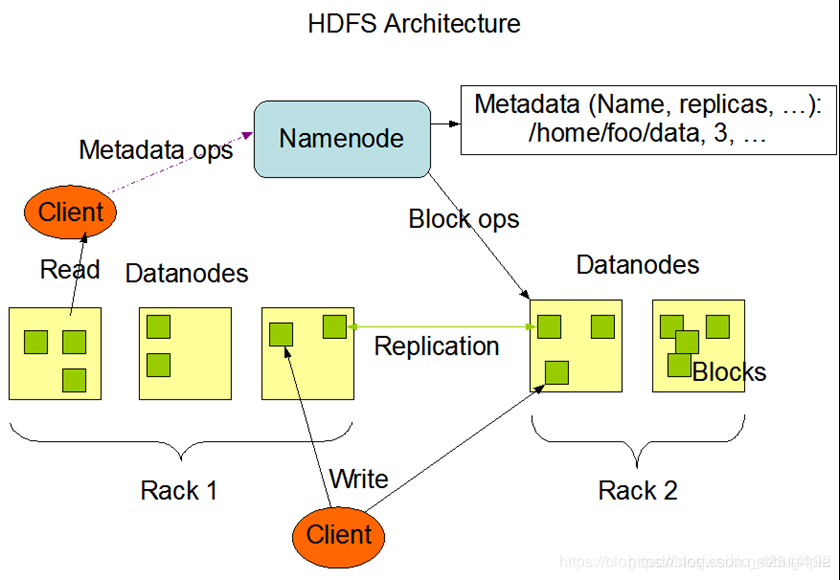

HDFS
====
HDFS（Hadoop Distributed File System）是Hadoop分布式计算框架中使用的分布式文件系统。它的架构和组成部分包括：

## NameNode（名称节点）
NameNode是HDFS的主节点，负责管理文件系统的命名空间和元数据。它维护文件和目录的层次结构，记录文件块的位置信息，并处理客户端的读写请求。NameNode还负责决定文件块的复制策略、处理数据节点的心跳和块报告等。

## DataNode（数据节点）
DataNode是HDFS的从节点，负责存储实际的数据块。每个数据节点管理自己本地存储，并根据NameNode的指示执行数据块的创建、复制、删除等操作。DataNode还定期向NameNode发送心跳和块报告，以报告其存储的数据块信息。

## Secondary NameNode（辅助名称节点）
Secondary NameNode并不是NameNode的热备份，而是一个辅助后台程序。它定期与NameNode通信，保存HDFS元数据的快照，以及备份其他NameNode中的内容。在NameNode故障时，Secondary NameNode可以顶替NameNode继续提供服务。

## 客户端
客户端是与HDFS交互的应用程序或用户。客户端可以通过HDFS的API或命令行工具与HDFS进行通信，执行文件的读写操作。客户端将读取请求发送给NameNode，并从DataNode获取数据块进行读取，或将写入请求发送给NameNode，并将数据块写入DataNode。

在HDFS中，文件被分成固定大小的数据块，并通过数据块的复制来提供数据的可靠性和容错能力。这些数据块被分散存储在不同的数据节点上，形成冗余备份。NameNode负责记录数据块的位置信息，并确保数据的一致性和可靠性。

HDFS的设计目标是适应大规模数据集的存储和处理，具有高容错性、高吞吐量和可靠性。它的分布式架构和数据冗余策略使得HDFS能够处理大规模数据，并提供高效的数据存储和访问能力。

## HDFS 存储原理
当你上传一个10GB大小的CSV文件到HDFS（Hadoop Distributed File System），HDFS会将该文件分成多个数据块并存储在不同的数据节点上。以下是HDFS存储的原理：

1. 数据块划分：HDFS将文件划分为固定大小的数据块，默认情况下为128MB。对于你的10GB文件，它将被划分成多个数据块，每个数据块大小为128MB（除了最后一个数据块可能会小于128MB）。

2. 副本复制：HDFS采用数据冗余的方式来提高数据可靠性。每个数据块会有多个副本，这些副本存储在不同的数据节点上，以提供容错能力。默认情况下，HDFS会创建3个副本，其中一个位于文件所在的数据节点上，其余两个位于不同的机架上的其他数据节点上。

3. 存储位置：数据块的存储位置信息被记录在HDFS的NameNode中，它是HDFS的主要控制节点。NameNode跟踪每个数据块的位置信息，包括副本所在的数据节点。

4. 数据节点存储：每个数据节点都有一个本地文件系统，用于存储数据块的副本。数据节点根据NameNode的指示来存储和管理数据块的复制。数据块会在数据节点之间进行复制，以确保数据的冗余备份。

5. 容错和可靠性：由于数据块有多个副本存储在不同的数据节点上，HDFS能够容忍数据节点故障或网络问题。如果某个数据节点发生故障，HDFS会自动选择其他副本来提供数据。NameNode也会监控数据节点的状态，并根据需要进行数据块的重新复制。

## HDFS划分数据块的过程：

1. 默认块大小：HDFS默认情况下将数据块大小设置为128MB，但你也可以根据需要进行配置。

2. 文件划分：当你上传一个文件到HDFS时，HDFS会将文件划分为多个数据块。划分过程是在文件被上传到HDFS之前完成的。

3. 字节划分：HDFS按字节进行划分，即从文件的起始位置开始，每128MB（或配置的块大小）划分一个数据块。划分过程将文件的字节范围映射到不同的数据块。

4. 最后一个数据块：如果文件的大小不是块大小的倍数，那么最后一个数据块的大小将小于块大小，通常是等于文件剩余字节数的大小。