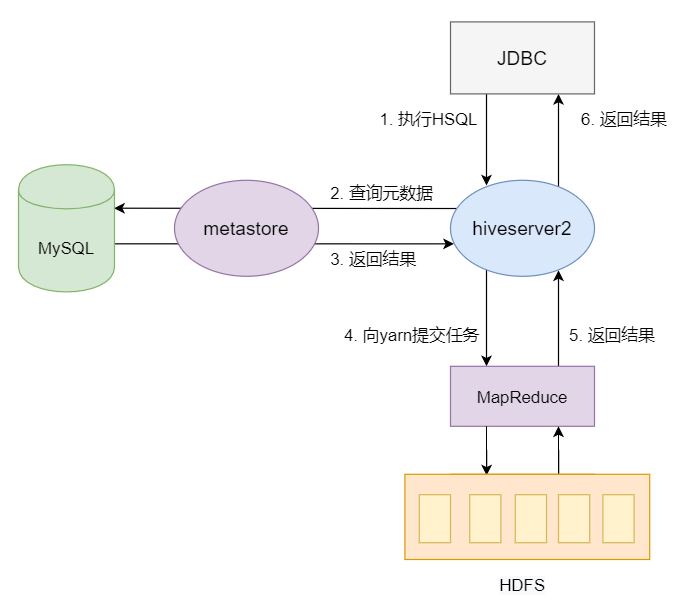
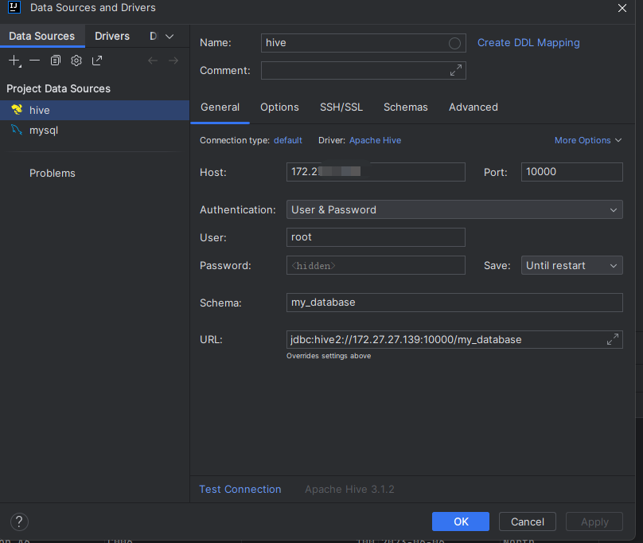

<!-- TOC -->
* [HiveServer2](#hiveserver2)
  * [hadoop 配置文件](#hadoop-配置文件)
    * [配置环境变量](#配置环境变量)
    * [修改 hadoop 的 core-site.xml](#修改-hadoop-的-core-sitexml)
    * [hdfs-site.xml](#hdfs-sitexml)
  * [hive 配置文件](#hive-配置文件)
    * [环境变量设置](#环境变量设置)
    * [修改 hive-site.xml](#修改-hive-sitexml)
    * [启动 hiveserver2 服务（前台方式）](#启动-hiveserver2-服务前台方式)
      * [启动 beeline 客户端连接hive](#启动-beeline-客户端连接hive)
      * [idea连接](#idea连接)
    * [启动 hiveserver2 服务（后台方式）](#启动-hiveserver2-服务后台方式)
<!-- TOC -->


# HiveServer2

为了让 java 程序可以连接 hive，执行sql，需要配置、启动 hiveserver2 服务




----

## hadoop 配置文件

### 配置环境变量

全

```shell
vim etc/hadoop/hadoop-env.sh
export JAVA_HOME=/usr/lib/jvm/java-1.8.0-openjdk-amd64
export HADOOP_CONF_DIR=/home/tianjian/warehouse/hadoop/hadoop-3.1.3/etc/hadoop
```

### 修改 hadoop 的 core-site.xml

允许用 root 用户登录hive，否则下面用 beeline 客户端连接不上hive

hive新增配置

```shell
<property>
    <name>hadoop.proxyuser.root.hosts</name>
    <value>*</value>
</property>
<property>
    <name>hadoop.proxyuser.root.groups</name>
    <value>*</value>
</property>
```

完整配置

```xml

<configuration>
    <property>
        <name>fs.defaultFS</name>
        <value>hdfs://localhost:9000</value>
    </property>

    <property>
        <name>hadoop.tmp.dir</name>
        <value>/home/tianjian/warehouse/hadoop/data/tmp</value>
    </property>
    <!-- 当前用户全设置成root -->
    <property>
        <name>hadoop.http.staticuser.user</name>
        <value>root</value>
    </property>
    <property>
        <name>hadoop.proxyuser.root.hosts</name>
        <value>*</value>
    </property>
    <property>
        <name>hadoop.proxyuser.root.groups</name>
        <value>*</value>
    </property>
</configuration>
```

### hdfs-site.xml

完整配置

```xml

<configuration>
    <property>
        <name>dfs.replication</name>
        <value>1</value>
    </property>
    <property>
        <name>dfs.namenode.name.dir</name>
        <value>/home/tianjian/warehouse/hadoop/data/name</value>
    </property>
    <property>
        <name>dfs.datanode.data.dir</name>
        <value>/home/tianjian/warehouse/hadoop/data/data</value>
    </property>
    <property>
        <name>dfs.permission</name>
        <value>false</value>
    </property>
    <property>
        <name>dfs.client.block.write.replace-datanode-on-failure.policy</name>
        <value>NEVER</value>
    </property>
    <property>
        <name>dfs.permissions.enabled</name>
        <value>false</value>
    </property>
    <property>
        <name>dfs.webhdfs.enabled</name>
        <value>true</value>
    </property>
</configuration>
```
----
## hive 配置文件

### 环境变量设置
```shell
vim ~/.bashrc
export JAVA_HOME=/usr/lib/jvm/java-1.8.0-openjdk-amd64  ## 这里要注意目录要换成自己解压的jdk 目录
export JRE_HOME=${JAVA_HOME}/jre
export CLASSPATH=.:${JAVA_HOME}/lib:${JRE_HOME}/lib
export PATH=${JAVA_HOME}/bin:$PATH

export HIVE_HOME=/home/tianjian/warehouse/hive/apache-hive-3.1.2-bin
export PATH=$PATH:$HIVE_HOME/bin
export HADOOP_HOME=/home/tianjian/warehouse/hadoop/hadoop-3.1.3
"~/.bashrc" 127L, 4202B
```

### 修改 hive-site.xml

vim conf/hive-site.xml

新增

```shell
<property>
# 端口
    <name>hive.server2.thrift.port</name>
    <value>10000</value>
  </property>
<property>
  <name>hive.server2.thrift.max.worker.threads</name>
  <value>100</value>
</property>
<property>
# 不认证，连接时无用户名和密码
  <name>hive.server2.authentication</name>
  <value>NONE</value>
</property>
 <property>
# 关闭用户认证
    <name>hive.server2.enable.doAs</name>
    <value>false</value>
    <description>
      Setting this property to true will have HiveServer2 execute
      Hive operations as the user making the calls to it.
    </description>
  </property>
```

全

```xml

<configuration>
    <property>
        <name>javax.jdo.option.ConnectionURL</name>
        <value>jdbc:mysql://localhost:3306/hive?createDatabaseIfNotExist=true&amp;useSSL=false&amp;allowPublicKeyRetrieval=true</value>
        <description>JDBC connect string for a JDBC metastore</description>
    </property>
    <property>
        <name>javax.jdo.option.ConnectionDriverName</name>
        <value>com.mysql.cj.jdbc.Driver</value>
        <description>Driver class name for a JDBC metastore</description>
    </property>
    <property>
        <name>javax.jdo.option.ConnectionUserName</name>
        <value>hive</value>
        <description>username to use against metastore database</description>
    </property>
    <property>
        <name>javax.jdo.option.ConnectionPassword</name>
        <value>hive</value>
        <description>password to use against metastore database</description>
    </property>
    <property>
        <name>datanucleus.autoCreateTables</name>
        <value>True</value>
    </property>
    <property>
        <name>hive.server2.thrift.port</name>
        <value>10000</value>
    </property>
    <property>
        <name>hive.server2.thrift.max.worker.threads</name>
        <value>100</value>
    </property>
    <property>
        <name>hive.server2.authentication</name>
        <value>NONE</value>
    </property>
    <property>
        <name>hive.server2.enable.doAs</name>
        <value>false</value>
        <description>
            Setting this property to true will have HiveServer2 execute
            Hive operations as the user making the calls to it.
        </description>
    </property>
</configuration>
```
### 启动 hiveserver2 服务（前台方式）

1. 重启hadoop start-dfs.sh 
   2. start-yarn.sh 
3. 启动 metastore 
   4. hive --service metastore 
   5. hive --service hiveserver2 
   6. 等待几分钟，才能看到端口起来 
   7. jps -ml 查看java进程 
      8. netstat -nltp | grep 10000 
      9. netstat -nltp | grep 10002


#### 启动 beeline 客户端连接hive

1. 直接连接
./bin/beeline -u jdbc:hive2://127.0.0.1:10000

2. 账号密码连接
```shell
tianjian@LAPTOP-287TPUGP:~/warehouse/hive/apache-hive-3.1.2-bin$ beeline
SLF4J: Class path contains multiple SLF4J bindings.
SLF4J: Found binding in [jar:file:/home/tianjian/warehouse/hive/apache-hive-3.1.2-bin/lib/log4j-slf4j-impl-2.10.0.jar!/org/slf4j/impl/StaticLoggerBinder.class]
SLF4J: Found binding in [jar:file:/home/tianjian/warehouse/hadoop/hadoop-3.1.3/share/hadoop/common/lib/slf4j-log4j12-1.7.25.jar!/org/slf4j/impl/StaticLoggerBinder.class]
SLF4J: See http://www.slf4j.org/codes.html#multiple_bindings for an explanation.
SLF4J: Actual binding is of type [org.apache.logging.slf4j.Log4jLoggerFactory]
Beeline version 3.1.2 by Apache Hive
beeline> !connect jdbc:hive2://127.0.0.1:10000
Connecting to jdbc:hive2://127.0.0.1:10000
Enter username for jdbc:hive2://127.0.0.1:10000:
Enter password for jdbc:hive2://127.0.0.1:10000:
Connected to: Apache Hive (version 3.1.2)
Driver: Hive JDBC (version 3.1.2)
Transaction isolation: TRANSACTION_REPEATABLE_READ
0: jdbc:hive2://127.0.0.1:10000> show databases;
INFO  : Compiling command(queryId=tianjian_20230913113214_0ce08fef-5c7c-46a8-818d-74945f85b6f1): show databases
INFO  : Concurrency mode is disabled, not creating a lock manager
INFO  : Semantic Analysis Completed (retrial = false)
INFO  : Returning Hive schema: Schema(fieldSchemas:[FieldSchema(name:database_name, type:string, comment:from deserializer)], properties:null)
INFO  : Completed compiling command(queryId=tianjian_20230913113214_0ce08fef-5c7c-46a8-818d-74945f85b6f1); Time taken: 0.009 seconds
INFO  : Concurrency mode is disabled, not creating a lock manager
INFO  : Executing command(queryId=tianjian_20230913113214_0ce08fef-5c7c-46a8-818d-74945f85b6f1): show databases
INFO  : Starting task [Stage-0:DDL] in serial mode
INFO  : Completed executing command(queryId=tianjian_20230913113214_0ce08fef-5c7c-46a8-818d-74945f85b6f1); Time taken: 0.013 seconds
INFO  : OK
INFO  : Concurrency mode is disabled, not creating a lock manager
+----------------+
| database_name  |
+----------------+
| default        |
| hive           |
| my_database    |
+----------------+
3 rows selected (0.059 seconds)
```

#### idea连接

1. 下载驱动
2. 确定host和port
3. 认证方式


### 启动 hiveserver2 服务（后台方式）

使用前台方式启动服务，窗口不能关闭，可以用后台方式启动


`nohup hive --service hiveserver2 2>&1 &`

**解释：**

nohup: 放在命令开头，表示不挂起，也就是关闭终端进程也继续保持运行状态

/dev/null：是 Linux 文件系统中的一个文件，被称为黑洞，所有写入改文件的内容 都会被自动丢弃

2>&1: 表示将错误输出 重定向 到标准输出上
第一个2表示错误输出，另外0表示标准输入，1表示标准输出

&: 放在命令结尾,表示后台运行

一般会组合使用: nohup [xxx 命令操作]> file 2>&1 &，表示将 xxx 命令运行的结 果输出到 file 中，并保持命令启动的进程在后台运行。