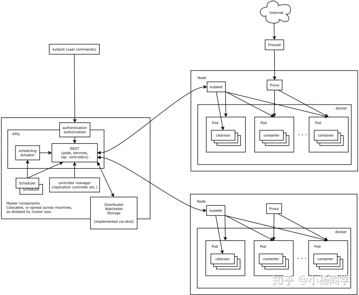
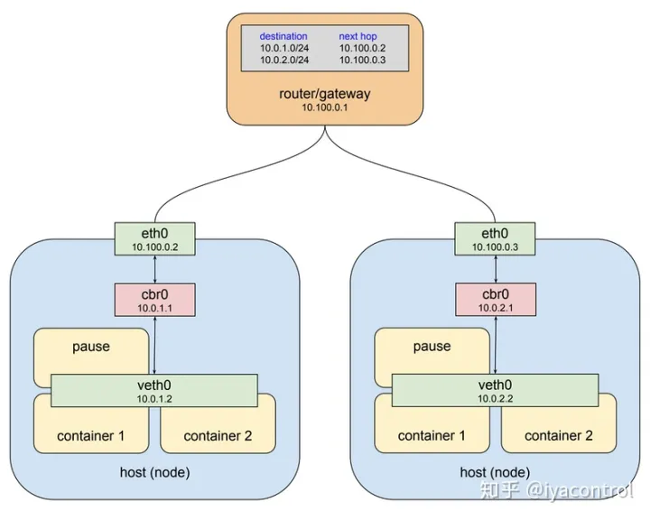

# k8s

## 一、解决的问题

从架构设计层面，我们关注的可用性，伸缩性都可以结合k8s得到很好的解决，如果你想使用微服务架构，搭配k8s，真的是完美，再从部署运维层面，服务部署，服务监控，应用扩容和故障处理，k8s都提供了很好的解决方案。

具体来说，主要包括以下几点：

1. 服务发现与调度
2. 负载均衡
3. 服务自愈
4. 服务弹性扩容
5. 横向扩容
6. 存储卷挂载

总而言之，k8s可以使我们应用的部署和运维更加方便



k8s集群由Master节点和Node（Worker）节点组成。

Master节点

Master节点指的是集群控制节点，管理和控制整个集群，基本上k8s的所有控制命令都发给它，它负责具体的执行过程。在Master上主要运行着：

Kubernetes Controller Manager（kube-controller-manager）：k8s中所有资源对象的自动化控制中心，维护管理集群的状态，比如故障检测，自动扩展，滚动更新等。
Kubernetes Scheduler（kube-scheduler）： 负责资源调度，按照预定的调度策略将Pod调度到相应的机器上。
etcd：保存整个集群的状态。
Node节点

除了master以外的节点被称为Node或者Worker节点，可以在master中使用命令 kubectl get nodes查看集群中的node节点。每个Node都会被Master分配一些工作负载（Docker容器），当某个Node宕机时，该节点上的工作负载就会被Master自动转移到其它节点上。在Node上主要运行着：

kubelet：负责Pod对应的容器的创建、启停等任务，同时与Master密切协作，实现集群管理的基本功能
kube-proxy：实现service的通信与负载均衡
docker（Docker Engine）：Docker引擎，负责本机的容器创建和管理

## 二、 Pods理解

Pod 是 Kubernetes 中的基本构建块，用于封装一个或多个容器，并提供了容器之间的共享资源和网络命名空间。理解 Pod 对于理解 Kubernetes 中的应用程序部署和管理非常重要。在实践中，开发人员和运维团队通常更多地关注于 Pod 的创建、管理和部署，而不是单独的容器。

在 Kubernetes 中，Pod 是最小的部署单元，它是容器的封装。理解 Pod 需要考虑以下几个关键点：

1. Pod 是容器的逻辑宿主： Pod 可以包含一个或多个容器，这些容器在同一个网络命名空间中运行，并且共享相同的存储卷。这意味着它们可以轻松地相互通信，共享数据，以及协同工作。
3. Pod 是临时性的： Pods 可能不是永久存在的。Kubernetes 可能会在节点上重新启动 Pod，将其重新调度到另一个节点上，或者根据需要创建新的 Pod 副本。因此，你不应该假设 Pod 是持久存在的，应该将其视为临时性的实例。
5. Pod 共享 IP 地址和端口： 在同一个 Pod 中的容器共享相同的 IP 地址和端口空间。这意味着它们可以使用 localhost 来相互通信，并且不需要 NAT 转发。
7. Pod 可以拥有多个容器： 一个 Pod 可以包含多个容器，这些容器可以协同工作。这通常用于将一些辅助容器（例如，日志收集器、监控代理）与主要应用程序容器放在同一个 Pod 中，以便它们可以共享相同的网络和存储卷。
9. Pod 通常由控制器管理： 通常，Pod 不是直接由用户手动创建的，而是由控制器（如 Deployment、ReplicaSet）管理。控制器负责确保指定数量的 Pod 副本在集群中运行，并在需要时创建或删除它们。
11. Pod 用于负载均衡和扩展： Pods 可以根据负载均衡的需要创建多个副本，以增加应用程序的可用性和性能。负载均衡服务通常会将流量分发到多个 Pod 实例中。




#### Pods和容器区别

    Pod 是 Kubernetes 的最小调度单位，它可以包含一个或多个容器。
    所有容器共享相同的网络命名空间和存储卷，它们可以使用 localhost 直接通信。
    Pods 被设计为共享生命周期，它们会一起启动、停止和重新调度。

    容器（Container）：
    容器是应用程序的运行时环境，它包含了应用程序及其所有依赖项，以及文件系统、库和配置。
    容器可以单独运行，也可以与其他容器组合在同一个 Pod 内。
    容器化应用程序可以在不同的环境中运行，例如开发、测试和生产环境。
    总的来说，Pods 是 Kubernetes 的部署单元，用于将一组相关的容器组合在一起，并提供它们之间的共享资源。容器是应用程序的运行时载体，可以独立运行，也可以组合在一个 Pod 中。理解这两个概念有助于更好地管理和部署容器化应用程序。【1】

## 三、k8s 部署示例

### 负载均衡示例


1. **创建后端 Pod 部署：** 首先，创建一个或多个后端 Pod 部署，这些 Pod 包含你的应用程序或服务的实际副本。每个 Pod 部署可以包含多个副本，以提高可用性和性能。

   以下是一个示例的 Deployment 配置文件，创建一个后端 Pod 部署：

    ```yaml
    apiVersion: apps/v1
    kind: Deployment
    metadata:
      name: backend-deployment
    spec:
      replicas: 3  # 设置副本数量
      selector:
        matchLabels:
          app: backend
      template:
        metadata:
          labels:
            app: backend
        spec:
          containers:
          - name: backend-app
            image: your-backend-image:latest
            ports:
            - containerPort: 80
    ```

   部署这个 Deployment：

    ```bash
    kubectl apply -f backend-deployment.yaml
    ```

2. **创建负载均衡服务：** 创建一个 Service 对象，用于负载均衡流量到后端 Pod 部署。你可以使用 `LoadBalancer` 类型的服务，该服务类型会与云提供商的负载均衡器集成，自动分配外部 IP 地址。

   以下是一个示例的 Service 配置文件：

    ```yaml
    apiVersion: v1
    kind: Service
    metadata:
      name: backend-service
    spec:
      selector:
        app: backend
      ports:
      - protocol: TCP
        port: 80
        targetPort: 80
      type: LoadBalancer  # 使用 LoadBalancer 服务类型
    ```

   部署这个 Service：

    ```bash
    kubectl apply -f backend-service.yaml
    ```

3. **访问负载均衡服务：** 现在，你可以通过负载均衡服务的外部 IP 地址来访问你的应用程序。Kubernetes 将自动分发流量到后端 Pod 部署中的多个副本，实现负载均衡。

    * 获取 LoadBalancer 服务的外部 IP 地址：

        ```bash
        kubectl get svc backend-service
        ```

    * 使用外部 IP 地址访问你的应用程序。


这样，你就创建了一个负载均衡的服务集群，使流量能够均匀分发到后端 Pod 部署中的多个副本，从而提高了应用程序的可用性和性能。请注意，`LoadBalancer` 类型的服务在不同的云提供商上的实现方式可能会有所不同，但 Kubernetes 会自动处理与云提供商的集成。


### replicas含义

在 Kubernetes 中，`replicas` 是一个用于指定副本数量的字段，通常用于控制 Pod 或 Deployment 的副本数量。`replicas` 字段用于指示 Kubernetes 在集群中运行多少个相同的副本，以实现高可用性、负载均衡和扩展性。以下是 `replicas` 字段的含义：

1. **Pod 中的 `replicas`：** 当你创建一个 Pod 时，可以通过 `replicas` 字段指定在集群中要运行的相同 Pod 的数量。这对于需要多个相同副本的任务非常有用，例如负载均衡、高可用性或并行处理。在 Pod 中使用 `replicas` 不太常见，通常更多地使用 Deployment 来管理 Pod 的副本数量。

2. **Deployment 中的 `replicas`：** 在 Kubernetes 中，通常使用 Deployment 来管理 Pod 的副本数量。Deployment 是一个控制器，它可以确保指定数量的 Pod 副本在集群中运行。你可以在 Deployment 配置文件中设置 `replicas` 字段，以指示 Deployment 应该维护多少个相同的 Pod 副本。

   例如，在以下 Deployment 配置文件中，`replicas` 设置为 3，表示希望有三个相同的 Pod 副本在运行：

    ```yaml
    apiVersion: apps/v1
    kind: Deployment
    metadata:
      name: my-deployment
    spec:
      replicas: 3
      selector:
        matchLabels:
          app: my-app
      template:
        metadata:
          labels:
            app: my-app
        spec:
          containers:
          - name: my-container
            image: my-image:latest
    ```


通过调整 `replicas` 字段的值，你可以轻松地扩展或缩减你的应用程序，以满足不同的负载需求。Deployment 会根据 `replicas` 的设置来创建或删除 Pod 副本，以确保所需的数量一直在运行。


### 部署订单销售服务示例

部署和维护一个复杂的应用程序涉及多个步骤和配置文件，因此无法在单个回答中提供完整的示例。然而，我可以为你提供一个基本的示例，包括 Kubernetes 配置文件和一个简单的维护脚本，以供参考。请注意，这只是一个起点，你可能需要根据你的具体需求进行进一步定制。

首先，我们将创建两个 Deployment，分别用于订单服务和支付服务，并使用 Service 来实现负载均衡。

1. **订单服务 Deployment 和 Service 配置文件（order-deployment.yaml）：**

```yaml
apiVersion: apps/v1
kind: Deployment
metadata:
  name: order-deployment
spec:
  replicas: 3  # 根据需要调整副本数量
  selector:
    matchLabels:
      app: order-service
  template:
    metadata:
      labels:
        app: order-service
    spec:
      containers:
      - name: order-container
        image: your-order-image:latest
        ports:
        - containerPort: 80

---
apiVersion: v1
kind: Service
metadata:
  name: order-service
spec:
  selector:
    app: order-service
  ports:
  - protocol: TCP
    port: 80
    targetPort: 80
  type: LoadBalancer  # 根据需要选择适当的服务类型
```

2. **支付服务 Deployment 和 Service 配置文件（payment-deployment.yaml）：**

```yaml
apiVersion: apps/v1
kind: Deployment
metadata:
  name: payment-deployment
spec:
  replicas: 3  # 根据需要调整副本数量
  selector:
    matchLabels:
      app: payment-service
  template:
    metadata:
      labels:
        app: payment-service
    spec:
      containers:
      - name: payment-container
        image: your-payment-image:latest
        ports:
        - containerPort: 80

---
apiVersion: v1
kind: Service
metadata:
  name: payment-service
spec:
  selector:
    app: payment-service
  ports:
  - protocol: TCP
    port: 80
    targetPort: 80
  type: LoadBalancer  # 根据需要选择适当的服务类型
```

上述配置文件将部署两个应用程序服务，并使用负载均衡服务将流量分发到多个副本中。

3. **部署应用程序：**

使用 `kubectl apply` 命令部署上述配置文件：

```bash
kubectl apply -f order-deployment.yaml
kubectl apply -f payment-deployment.yaml
```

4. **维护和升级脚本：**

以下是一个简单的 Bash 脚本示例，用于维护和升级你的应用程序。你可以根据需要扩展这个脚本，以适应更复杂的维护任务。

```bash
#!/bin/bash

# 维护订单服务
kubectl scale deployment order-deployment --replicas=0  # 暂时缩减副本数
# 执行维护操作，如数据库迁移或更新
kubectl scale deployment order-deployment --replicas=3  # 恢复副本数

# 维护支付服务
kubectl scale deployment payment-deployment --replicas=0  # 暂时缩减副本数
# 执行维护操作，如数据库迁移或更新
kubectl scale deployment payment-deployment --replicas=3  # 恢复副本数

# 升级应用程序
kubectl set image deployment/order-deployment order-container=your-new-order-image:latest
kubectl set image deployment/payment-deployment payment-container=your-new-payment-image:latest
```

这个脚本演示了如何暂时缩减副本数来执行维护操作，然后再次恢复副本数。此外，它还演示了如何升级应用程序的容器镜像。
