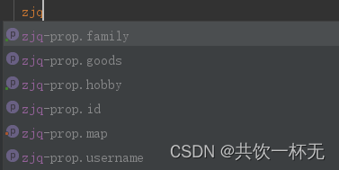

<!-- TOC -->
* [全局配置文件](#全局配置文件)
  * [application.properties配置文件](#applicationproperties配置文件)
  * [配置文件属性值的注入使用](#配置文件属性值的注入使用)
<!-- TOC -->

# 全局配置文件
全局配置文件能够对一些默认配置值进行修改。Spring Boot使用一个application.properties或者application.yaml的文件作为全局配置文件，该文件存放在src/main/resource目录或者类路径的/config，一般会选择resource目录。接下来，将针对这两种全局配置文件进行讲解∶

## application.properties配置文件
使用Spring lnitializr方式构建Spring Boot项目时，会在resource目录下自动生成一个空的application.properties文件，Spring Boot项目启动时会自动加载application.properties文件。我们可以在application.properties文件中定义Spring Boot项目的相关属性，当然，这些相关属性可以是系统属性、环境变量、命令参数等信息，也可以是自定义配置文件名称和位置。

```xml
server.port=17006
spring.config.name=zjq
spring.application.name=zjq-properties
spring.redis.host=localhost
spring.redis.port=6039
spring.redis.password=
spring.redis.database=0
```

接下来，通过一个案例对Spring Boot项目中application.properties配置文件的具体使用进行讲解。
演示:准备两个实体类文件，演示将application.properties配置文件中的自定义配置属性注入到PropertiesConfig实体类的对应属性中

创建两个实体类Goods和PropertiesConfig

```java
@Data
public class Goods {

    private Integer id;
    private String name;
}

@ConfigurationProperties(prefix = "zjq-prop")
@Component
@Data
public class PropertiesConfig {

    private Integer id;
    private String username;
    private List hobby;
    private String[] family;
    private Map map;
    private Goods goods;
}
```

@ConfigurationProperties： 将配置文件中以zjqProp开头的属性通过setXxx方法注入到该类的属性中
@Component： 把PropertiesConfig类作为Bean到spring容器中，只有这样才能@ConfigurationProperties注解进行赋值

在resources目录下创建的application.properties文件配置如下：


编写application.properties配置文件时，由于要配置的PropertiesConfig对象属性是我们自定义的,Spring Boot无法自动识别，所以不会有任何书写提示。在实际开发中，为了出现代码提示的效果来方便配置，在使用@ConfigurationProperties注解进行配置文件属性值注入时，可以在pom.xml文件中添加一个SpringBoot提供的配置处理器依赖:

```
<!--自定义配置提示-->
<dependency>
  <groupId>org.springframework.boot</groupId>
  <artifactId>spring-boot-configuration-processor</artifactId>
  <optional>true</optional>
</dependency>
```

在pom.xml中添加上述配置依赖后，还需要重新运行项目启动类或者使用“Ctrl+F9"快捷键（即BuildProject)重构当前Spring Boot项目方可生效。


查看application.properties配置文件是否正确，同时查看属性配置效果，创建项目测试类，在该测试类中引入PropertiesConfig实体类Bean，并进行输出测试。

```java
@RunWith(SpringRunner.class) // 测试启动类，并加载Spring Boot测试注解
@SpringBootTest //标记为SpringBoot测试类，并加载ApplicationContext上下文环境
public class ConfigTest {

    @Autowired
    private PropertiesConfig propertiesConfig;
    @Test
    public void propertiesConfigTest(){
        System.out.println(propertiesConfig);
    }
}
```

输出如下：


至此，说明application.properties配置文件属性配置正确，并通过相关注解自动完成了属性注入。

🍊application.yaml配置文件
YAML文件格式是Spring Boot支持的一种JSON超集文件格式，相较于传统的Properties配置文件，YAML文件以数据为核心，是一种更为直观且容易被电脑识别的数据序列化格式。application.yaml配置文件的工作原理和application.properties是一样的，只不过yaml格式配置文件看起来更简洁一些。我本人开发过程中一般用这种格式，更简洁更有层次感。
YAML文件的扩展名可以使用.yml或者.yaml。
application.yml文件使用“key:(空格)value"格式配置属性，使用缩进控制层级关系。这里，针对不同数据类型的属性值，介绍一下YAML

🍋value值为普通数据类型（例如数字、字符串、布尔等)
当YAML配置文件中配置的属性值为普通数据类型时，可以直接配置对应的属性值，同时对于字符串类型的属性值，不需要额外添加引号，示例代码如下

value值为数组和单列集合
当YAML配置文件中配置的属性值为数组或单列集合类型时，主要有两种书写方式︰缩进式写法和行内式写法。缩进式有两种写法，行内式写法如下

```xml
zjq-yml:
  #缩进式写法1
  hobby:
    - 爬山
    - 羽毛球
    - 篮球
  #缩进式写法2
  hobby:
    爬山,
    羽毛球,
    篮球    
  #行内式写法
  hobby:[爬山,羽毛球,篮球]  
```

通过上述示例对比发现，YAML配置文件的行内式写法更加简明、方便。另外，包含属性值的中括号“[”还可以进一步省略，在进行属性赋值时，程序会自动匹配和校对

🍍value值为Map集合和对象
当YAML配置文件中配置的属性值为Map集合或对象类型时，YAML配置文件格式同样可以分为两种书写方式:缩进式写法和行内式写法。

```
zjq-yml:
  #缩进式写法
  map:
    name: 共饮一杯无
    feature: 相当哇塞
  #行内式写法
  map: {"name":"共饮一杯无","feature":"相当哇塞"}
```

在YAML配置文件中，配置的属性值为Map集合或对象类型时，缩进式写法的形式按照YAML文件格式编写即可，而行内式写法的属性值要用大括号“"包含。
接下来，在Properties配置文件演示案例基础上，通过配置application.yaml配置文件对YmlConfig对象（属性同上述PropertiesConfig类）进行赋值，具体使用如下

在项目的resources目录下，新建一个application.yml配置文件，在该配置文件中编写为YmlConfig类设置的配置属性。

```xml
zjq-yml:
  id: 666
  username: 共饮一杯无
  hobby:
    - 爬山
    - 羽毛球
    - 篮球
  family: [father,mother,wife]
  #缩进式写法
#  map:
#    name: 共饮一杯无
#    feature: 相当哇塞
  #行内式写法
  map: {"name":"共饮一杯无","feature":"相当哇塞"}
  goods: {"id":"666","name":"宇宙飞船"}
```
执行测试验证
```java
  @Autowired
    private YmlConfig ymlConfig;

    @Test
    public void ymlConfigTest(){
        System.out.println(ymlConfig);
    }
```

## 配置文件属性值的注入使用

Spring Boot全局配置文件设置属性时:
如果配置属性是Spring Boot已有属性，例如服务端口server.port，那么Spring Boot内部会自动扫描并读取这些配置文件中的属性值并覆盖默认属性。
如果配置的属性是用户自定义属性，例如刚刚自定义的Person实体类属性，还必须在程序中注入这些配置属性方可生效。
Spring Boot支持多种注入配置文件属性的方式，下面来介绍如何使用注解@ConfigurationProperties和@Value注入属性

🍎使用@ConfigurationProperties注入属性
Spring Boot提供的@ConfigurationProperties注解用来快速、方便地将配置文件中的自定义属性值批量注入到某个Bean对象的多个对应属性中。上述全局配置properties和yml配置代码使用@Component和@ConfigurationProperties(prefix = “zjq-prop”)将配置文件中的每个属性映射到PropertiesConfig类组件中。此处不再赘述。

🍏使用@Value注入属性
@Value注解是Spring框架提供的，用来读取配置文件中的属性值并逐个注入到Bean对象的对应属性中，Spring Boot框架从Spring框架中对@value注解进行了默认继承，所以在Spring Boot框架中还可以使用该注解读取和注入配置文件属性值。使用@Value注入属性的示例代码如下。
配置类：

```java
@Configuration
@Data
public class ValueConfig {

    @Value("${my.name}")
    private String name;

    @Value("${my.address}")
    private String address;


    @Value("${my.feature}")
    private String feature;
}
```
上述代码中，使用@Configuration和@Value注入Person实体类的id属性。其中，@Value不仅可以将配置文件的属性注入Person的id属性，还可以直接给id属性赋值，这点是@ConfigurationProperties不支持的
配置文件：
```yaml
my:
  name: zjq-dev
  address: zjq-小溪
  feature: 帅的雅痞
```
测试验证：


```java
    @Autowired
    private ValueConfig valueConfig;

    @Test
    public void valueConfigTest(){
        System.out.println(valueConfig);
    }
```